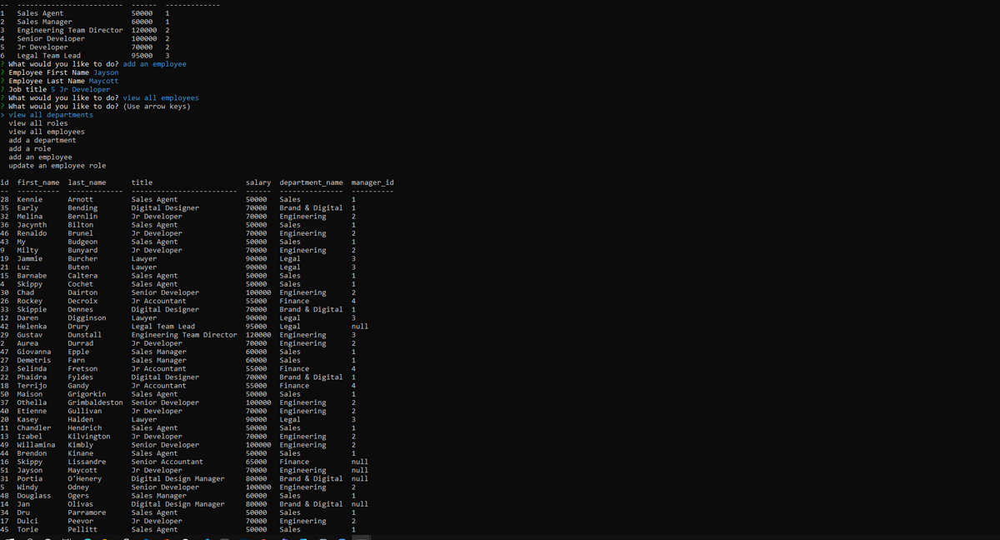

# Employee Tracker  
  

# Screenshot

# Description
A Command Line CMS for updating and adding Employee Data

# Table of Contents
*[Demo](#demo)  
*[Features](#features)  
*[Installation](#installation)  
*[Usage](#usage)  
*[Contribute](#contribute)  
*[Tests](#tests)  
*[Questions](#questions)  
*[License](#license)

# Demo
[DEMO: Employee Tracker](https://drive.google.com/file/d/1NUuoNG48AQyCn8ialSN5jevHAaWgGFrJ/preview)

# Features
uses node.js, mysql2, inquirer.js

# Installation  
Project Repository: [Employee Tracker](https://github.com/jmax407/employee_tracker)  
npm init, npm install inquirer, npm install mysql2 

# Usage
[Employee Tracker](https://jmax407.github.io/employee_tracker/)  
node index to start the project, follow the prompts

# Contribute 
n/a

# Tests
n/a

# Questions
Feel free to reach out if you have any questions

Contact via GitHub: [jmax407](https://github.com/jmax407)  
Send an email: [jmax407@gmail.com](mailto:jmax407@gmail.com)

# License
None
